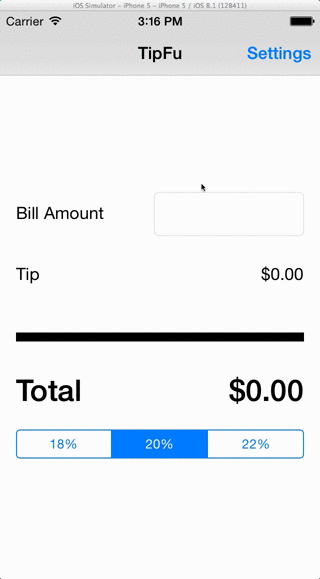

# TipFu

This is the initial application required for CodePath. It calculates tips given a bill amount.

Time spent: 1 hour

Tasks Completed:

* [x] Required: User can enter a bill amount, choose a tip percentage, and see the tip and total values.
* [x] Required: User can select a default tip percentage on a settings page. That value is persisted and selected when the user navigates back to the root view controller
* [x] Optional: Using locale-specific currency and currency thousands separators.

